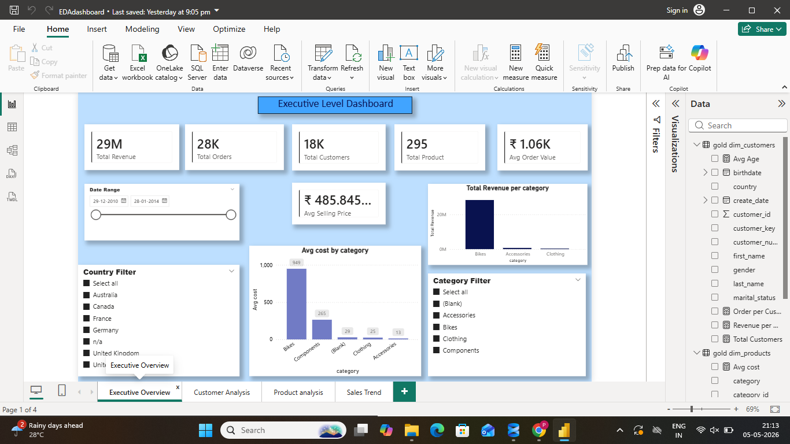
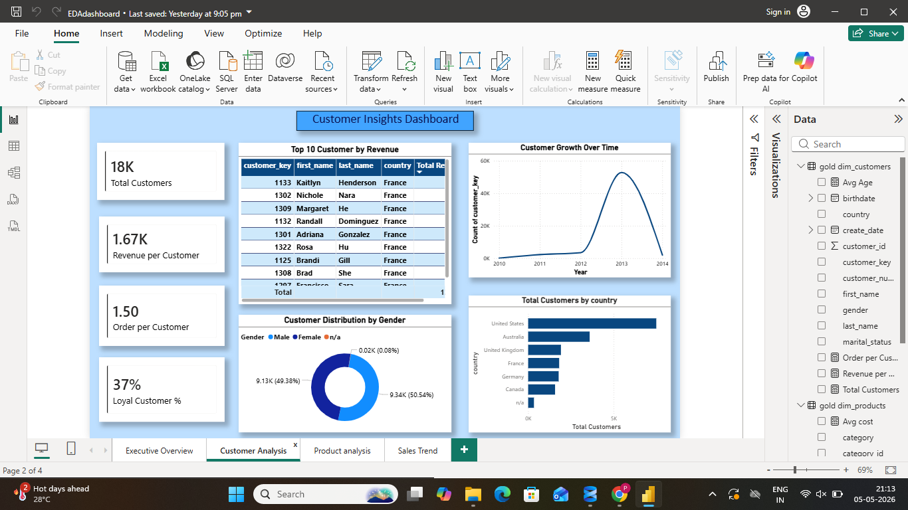
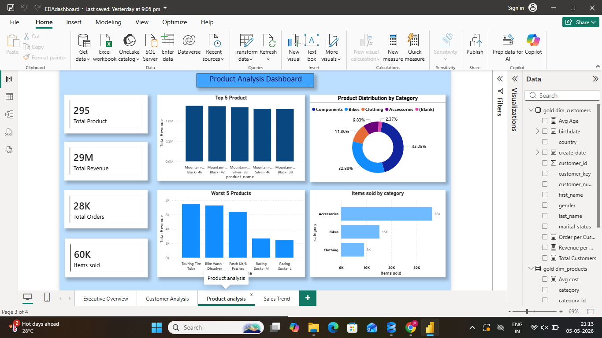
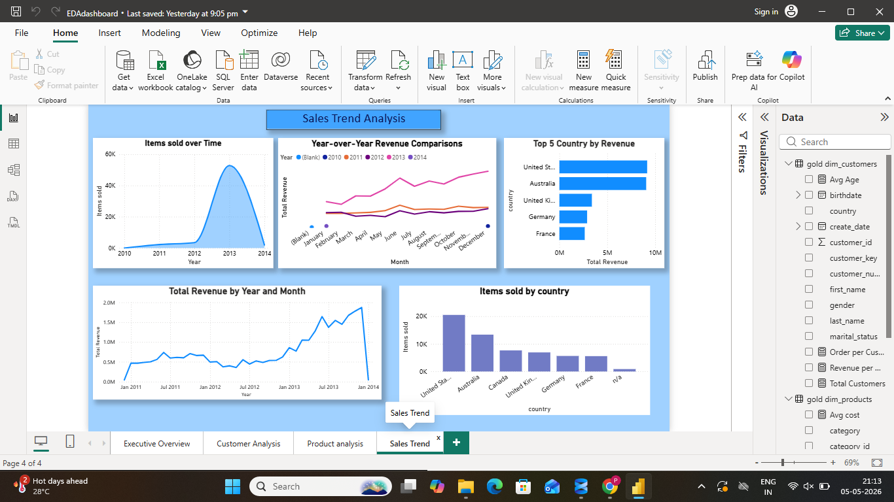

# DataWarehouseAnalyticsEDA
SQL + Power BI Data Analytics Project

====================================================================================================================
## 🚀 Project Overview

This project demonstrates a complete **end-to-end data analytics workflow**, including:

* Data Warehouse Design (SQL)
* Data Modeling
* Data Analysis using SQL
* Interactive Dashboard Development using Power BI

The objective was to convert raw transactional data into **actionable business insights** across customers, products, and sales.

----------------------------------------------------------------------------------------------------------------------------------

## 🏗️ Data Warehouse & Data Modeling

* **Database:** DataWarehouseAnalytics
* **Schema:** gold
* **Model Type:** Star Schema

### 📂 Tables Used

* `gold.dim_customers` – Customer details 
* `gold.dim_products` – Product information 
* `gold.fact_sales` – Sales transactions

### 🔗 Data Modeling (Power BI)

* Established relationships between **fact and dimension tables**
* Designed a **star schema model** for efficient reporting
* Enabled cross-filtering for interactive dashboards

--------------------------------------------------------------------------------------------------------------------------

## 🔍 SQL-Based Analysis

### 🧪 Exploratory Data Analysis

* Identified **youngest and oldest customers**

### 📈 Measure Exploration

* Total Sales
* Total Quantity
* Average Price
* Total Orders
* Total Products
* Total Customers

### 🌍 Magnitude Analysis

* Customers by country & gender
* Products by category
* Average cost per category
* Revenue by category & customer
* Items sold distribution across countries

### 🏆 Ranking Analysis

* Top 5 revenue-generating products
* Bottom 5 lowest-performing products

------------------------------------------------------------------------------------------------------------------------------

## 📊 Power BI Dashboards (4 Pages)

### 1️⃣ Executive Overview

* KPIs: Total Revenue, Orders, Customers, Products
* Avg Order Value & Avg Selling Price
* Revenue by Category
* Filters: Date, Country, Category

---

### 2️⃣ Customer Analysis

* Customer growth over time (Line Chart)
* Top 10 customers by revenue
* Customer distribution by gender
* Customers by country

---

### 3️⃣ Product Analysis

* Top 5 products by revenue
* Bottom 5 products
* Product distribution by category
* Items sold by category

---

### 4️⃣ Sales Trend Analysis

* Revenue trend over time
* Year-over-year comparison
* Items sold over time
* Top countries by revenue

---

## 🎯 Key Insights

* Bikes category generates the highest revenue
* Identified top-performing and underperforming products
* Customer base shows growth trend over time
* Revenue contribution varies significantly across countries

-----------------------------------------------------------------------------------------------------------------------------

## 🛠️ Tools & Technologies

* SQL (Data Warehouse Design & Analysis)
* Power BI (Data Modeling & Visualization)

---

## 📸 Dashboard Preview

### Executive Level Dashboard

### Customer Insight Dashboard

### Product Analysis Dashboard

### Sales Trend Analysis

---

## 💡 What This Project Demonstrates

* Data Warehouse Design (Star Schema)
* SQL Analytical Skills
* Data Modeling in Power BI
* Dashboard Design & Visualization
* Business Insight Generation

---

## 👩‍💻 About Me

Aspiring Data Analyst with hands-on experience in SQL and Power BI, focused on building data-driven solutions and delivering business insights.

---

⭐ This project reflects my ability to work on real-world data analytics problems from data preparation to visualization.
